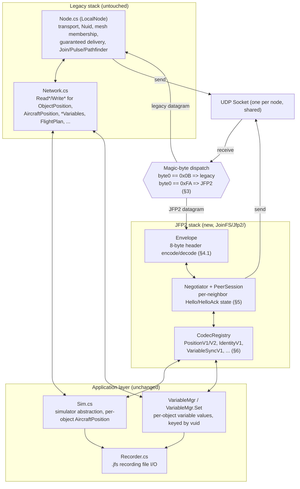
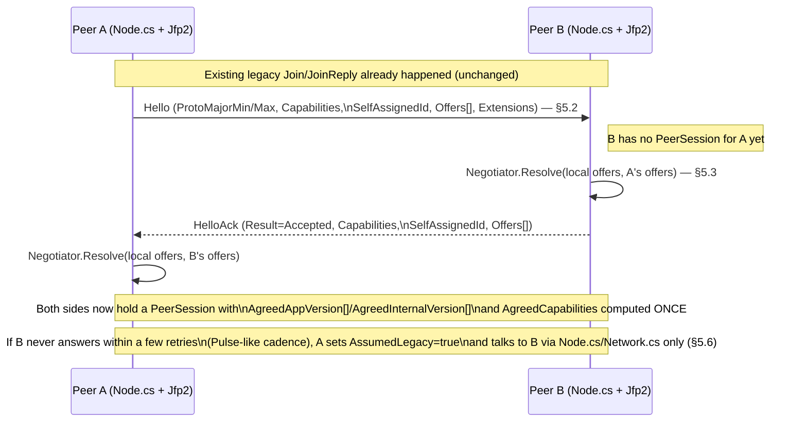
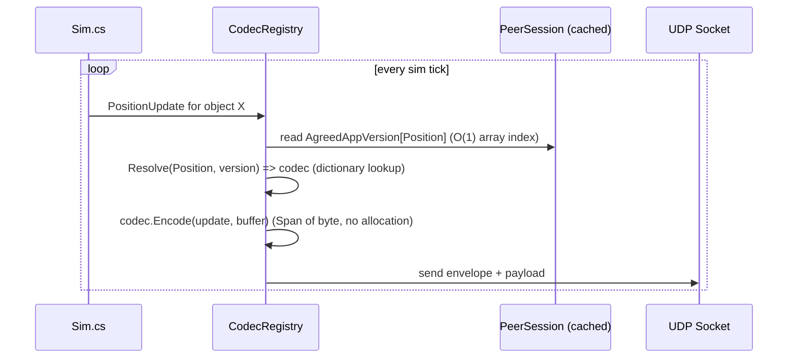
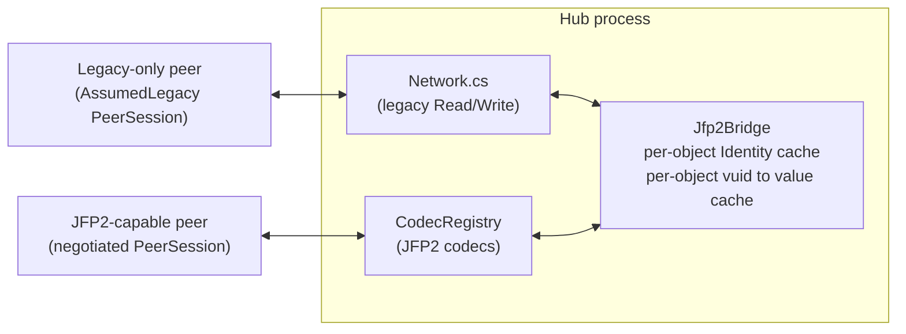
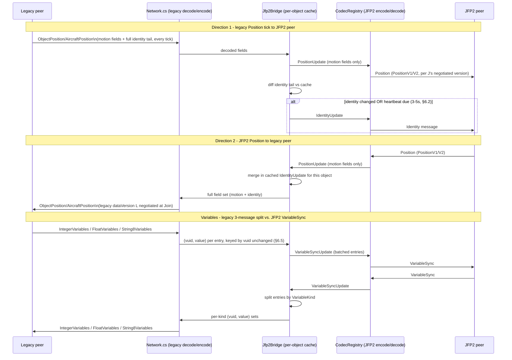
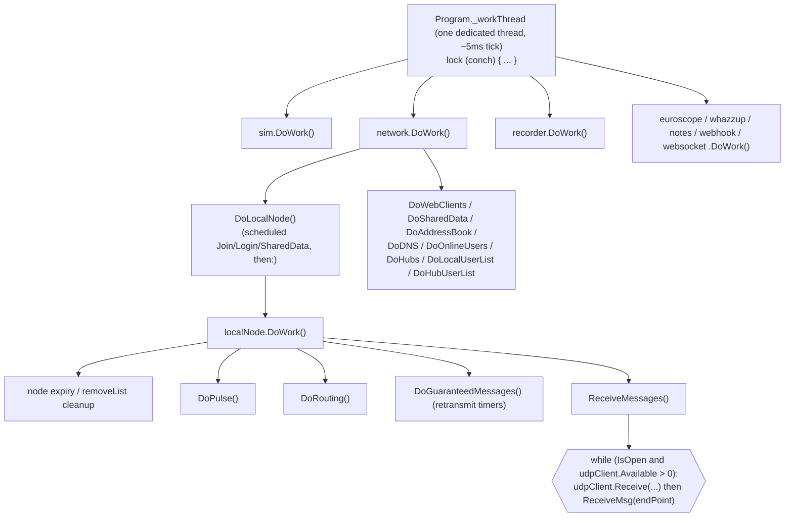

# JFP2 Implementation Architecture — Diagrams

This document is a companion to `docs/protocol-v2-design.md` (the protocol specification and
rationale) and `docs/protocol-changes-v26.4-v26.5.md`/`docs/recording-protocol.md` (the prior audits
that motivated it). It does not repeat the wire-format spec or the reasoning behind it — see those
documents for that — it only diagrams **how JFP2 would be structured as code inside `JoinFS/`** and
how the pieces talk to each other at runtime. Section numbers in parentheses (e.g. "§5.3") refer to
`docs/protocol-v2-design.md`.

## 1. Process-level component diagram (every build variant)

Every JoinFS process — whatever simulator variant, including `CONSOLE` — ends up with the same shape:
one UDP socket shared by two independent stacks, dispatched by the first byte of each datagram
(§3), sitting below the same application layer (`Sim.cs`, `VariableMgr`, `Recorder.cs`) that exists
today and does not need to know which stack produced or will consume its data.

Two things this diagram is meant to make concrete:

- **The only touch to existing code on the receive path is the dispatch step.** Everything under
  `LEGACY` is `Node.cs`/`Network.cs` exactly as they are today (§7.5); the one-line addition is
  reading `datagram[0]` before handing the buffer to `LocalNode.ReceiveMsg` and branching to the new
  stack instead when it reads `0xFA`.
- **The application layer is genuinely shared, not duplicated.** `Sim.cs` and `VariableMgr` already
  hold the canonical in-memory state (`Sim.AircraftPosition`, `VariableMgr.Set`'s per-`vuid` values);
  both `Network.cs` (legacy) and the JFP2 `CodecRegistry` (new) serialize *that same state* to and from
  the wire independently. Neither stack owns a second copy of the application model — this is what
  makes coexistence (§7.1) possible without forking `Sim.cs` itself.

## 2. Proposed file layout

| Path | Status | Contents |
|---|---|---|
| `JoinFS/Node.cs` | **Minimally touched** | One dispatch check added at the top of the UDP receive callback (§3); everything else unchanged. |
| `JoinFS/Network.cs` | Untouched | Legacy application message `Read`/`Write` methods, used as-is by both the legacy path and the hub bridge (§7.7). |
| `JoinFS/Jfp2/Envelope.cs` | New | `EnvelopeFlags`, `MessageClasses`, `Envelope` struct (§4.1–§4.6), `PeerKey` (§4.7). |
| `JoinFS/Jfp2/Negotiation.cs` | New | `SchemaOffer`, `Capability`, `Tlv`, `HandshakeMessage`, `Negotiator`, `PeerSession` (§5). |
| `JoinFS/Jfp2/Codecs/ICodec.cs` | New | `ICodec<T>`, `CodecRegistry` (§6). |
| `JoinFS/Jfp2/Codecs/PositionCodecs.cs` | New | `PositionUpdate`, `PositionV1Codec`, `PositionV2Codec` (§6.1). |
| `JoinFS/Jfp2/Codecs/IdentityCodec.cs` | New | `IdentityUpdate`, `IdentityV1Codec` (§6.2). |
| `JoinFS/Jfp2/Codecs/VariableSyncCodec.cs` | New | `VariableKind`, `VariableEntry`, `VariableSyncUpdate`, `VariableSyncV1Codec` (§6.3, §6.5). |
| `JoinFS/Jfp2/Codecs/*` (Event/FlightPlan/Notes/Weather/Status) | New | Mechanical `v1` ports per §6.4, one file each following the same pattern. |
| `JoinFS/Jfp2/Jfp2Bridge.cs` | New, **hub role only** — currently an empty reserved class, not yet instantiated by anything | Per-object identity/variable cache and the decode-then-re-encode translation described in §7.7, for Tier 2 (differing JFP2 schema versions) and Tier 3 (JFP2↔legacy). **Not needed for the common case**: when both legs already agree on the same JFP2 schema version for a class (Tier 1 — implemented, see `docs/protocol-v2-implementation-plan.md` Phase 6), `LocalNode.RelayForwardedJfp2Datagram` forwards the datagram byte-for-byte, the same way the legacy `FLAG_FORWARD` relay works, without ever touching this class. The diagrams below predate that finding and still show the original "always decode via Jfp2Bridge" model — treat them as describing Tier 2/3 only; see Phase 6 for what Tier 1 actually does. |

`PeerSession` instances are keyed the same way `Node.cs` already keys its own per-neighbor state
(by `Nuid`/`IPEndPoint`), so JFP2 state rides alongside the existing mesh bookkeeping rather than
replacing or duplicating it.

## 3. Sequence: negotiation (two JFP2-capable peers becoming neighbors)

## 4. Sequence: steady-state hot path (Position, after negotiation)

This is the path the "shave the last millisecond" goal (§2, §5.3) targets: no branching on version or
capability once `PeerSession` exists.

## 5. Hub-specific component diagram (mixed legacy + JFP2 neighbors)

A hub (or any relaying node) that has one legacy-only neighbor and one JFP2-capable neighbor holds
**two independent `PeerSession`-equivalent states side by side** — one `AssumedLegacy` (handled purely
by `Node.cs`/`Network.cs`) and one fully negotiated JFP2 session — plus the `Jfp2Bridge` that sits
between them, per §7.7.

The bridge only exists on this hop; if both neighbors of a given relay turn out to share the same
protocol/version, the raw relay/broadcast path (`Node.cs`'s existing `Broadcast`/`FLAG_FORWARD`
machinery) is used unchanged and `Jfp2Bridge` is never invoked for that pair (§7.7).

## 6. Sequence: hub translation, both directions

## 7. Legend / reading notes

- Solid arrows: data flow that happens on every relevant message. Dashed/conditional (`alt` block):
  only happens when something changed or a timer elapsed.
- "Untouched" / "unchanged" always means byte-for-byte identical to the current `JoinFS/` code — JFP2
  adds new files and one dispatch check; it does not modify legacy read/write logic anywhere.
- The hub diagrams (§5–§6) are a special case of the general one (§1): a hub is simply a JoinFS process
  where two of its `PeerSession`s (or PeerSession-equivalents) happen to disagree on protocol, which is
  exactly the condition that activates `Jfp2Bridge` for that specific pair (§7.7).

## 8. Threading model and tick-loop integration

Sections 1–6 show JFP2 as a second stack "beside" the legacy one. This section grounds that in the
actual current control flow, traced from `JoinFS/Program.cs` and `JoinFS/Node.cs`, because it drives a
concrete conclusion: **JFP2 introduces zero new threads and zero new locks.**

### 8.1 The current call chain

JoinFS runs everything — simulator polling, networking, recording — on **one dedicated background
thread**, `Program._workThread` (`new Thread(new ThreadStart(DoWork))`), executing an unbounded loop
that targets a ~5ms tick (it sleeps `5 - duration` after each pass) and wraps the whole pass in a
single `lock (conch)`:

Two properties of this that matter for JFP2:

- **Receive is a poll, not a callback.** `LocalNode.ReceiveMessages()` does not use `BeginReceive`/
  `ReceiveAsync`; it drains whatever is already sitting in `udpClient.Available` synchronously, once
  per tick, calling `ReceiveMsg(endPoint)` inline for each datagram before moving to the next. There is
  no separate I/O thread delivering datagrams asynchronously.
- **Send is "prepare once into a shared buffer, then broadcast the same bytes."** The typical call
  pattern (e.g. in `Sim.cs`) is `network.WriteAircraftPositionMessage(...)` — which serializes into
  `LocalNode`'s single shared `sendBuffer` — immediately followed by `network.localNode.Broadcast()`,
  which sends *that one already-serialized buffer* to every node in `nodes`. One serialize, fanned out
  verbatim to every neighbor.

### 8.2 Where JFP2 hooks in — same thread, same lock, same tick

| Existing call site | JFP2 addition |
|---|---|
| `ReceiveMessages()`'s `while` loop, right after `udpClient.Receive` returns `messageData` | Check `messageData[0]` before deciding how to handle it: `0x0B` → call `ReceiveMsg(endPoint)` exactly as today, unmodified; `0xFA` → call a new `Jfp2ReceiveMsg(endPoint, messageData)` instead. Both branches run to completion, on this same thread, inside this same `while` iteration, before the loop reads the next datagram — there is no interleaving to reason about because there was never any concurrency here. |
| `WriteAircraftPositionMessage(...)` + `Broadcast()` (and the equivalent `Write*`/`Send*Message` + `Broadcast()`/unicast `Send()` pairs elsewhere in `Sim.cs`/`Network.cs`) | Instead of one serialize + one broadcast-to-everyone, group the neighbors currently in `nodes` by what each one's `PeerSession` says (`AssumedLegacy`, or `AgreedAppVersion[MessageClass]`). Neighbors with no `PeerSession` or `AssumedLegacy == true` keep going through the untouched `Write*Message()` + `Broadcast()`/`Send()` path exactly as today. Neighbors with a resolved JFP2 version get a small parallel loop, right beside the existing one, that does `CodecRegistry.Resolve(...).Encode(...)` and sends the JFP2 envelope to just that subset. Still one pass, still this same thread, still this same tick. |
| `LocalNode.DoWork()`'s sequence of `DoPulse()` / `DoRouting()` / `DoGuaranteedMessages()` | Add sibling calls in the same sequence: a Hello-retry/`AssumedLegacy`-timeout check (mirrors `DoPulse()`'s cadence), the Identity 3–5s heartbeat (§6.2), and, if guaranteed JFP2 messages are used, a `DoJfp2GuaranteedMessages()` mirroring `DoGuaranteedMessages()`. All of these reuse the codebase's existing lightweight `JoinFS.Timer` (`Elapsed(main.ElapsedTime)`, the same idiom already driving `hubsTimer`/`internetAddressTimer`/etc.) — a plain polled interval check, not a `System.Threading.Timer` or a new thread. |
| Hub-only: the decode/cache/re-encode bridge (§7.7) | Called from *inside* the `Jfp2ReceiveMsg`/legacy `ReceiveMsg` branches above (to decode-and-cache) and from inside the per-group send loop above (to encode for the other side's group) — `Jfp2Bridge`'s per-object caches are plain dictionaries touched only from this one thread, exactly like `nodes` already is. |

### 8.3 Why no new thread or lock is needed — and the one escape hatch that exists if it ever were

Every piece of state JFP2 needs to read or write during a tick — the `nodes` dictionary, the new
`PeerSession` table, `CodecRegistry`, `Jfp2Bridge`'s per-object caches — is only ever touched from this
one thread, inside the single `conch` critical section networking already runs in today. Adding a
second thread that also reads the same `udpClient` or the same `nodes` table would be pure downside: it
would force new locking around state that currently needs none, to solve a problem (idle time on the
tick thread) that doesn't exist — the ~5ms budget is dominated by `sim.DoWork()`'s simulator polling,
not by draining a handful of already-queued UDP datagrams.

If some future JFP2 feature genuinely needed to block or run long (a DNS-style lookup, a large one-time
load), the codebase already has an established pattern for that, used today for exactly this reason:
dispatch it with `Task.Run(...)` and have it hand its result back through `Program._commandQueue` (a
`ConcurrentQueue<Action>`), which the work thread drains, still under `lock (conch)`, once per tick.
Nothing in the JFP2 design as specified needs this — Hello/HelloAck negotiation is a plain, small,
non-blocking message exchange handled the same way `Join`/`Pulse` already are — but it is the right
tool if that ever changes, rather than introducing a dedicated JFP2 thread.
