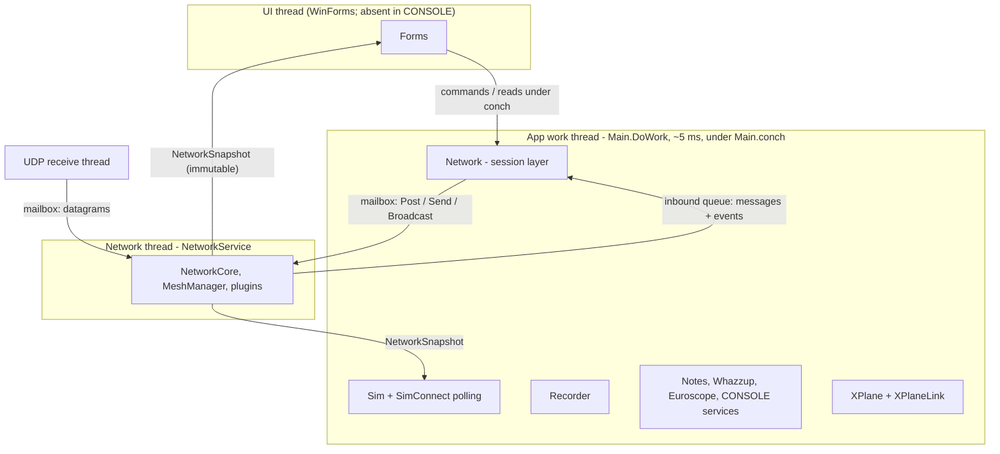
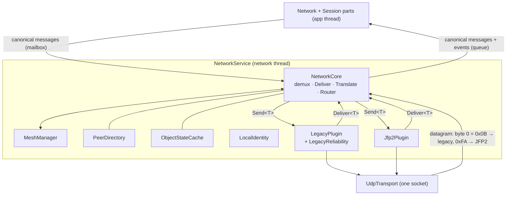
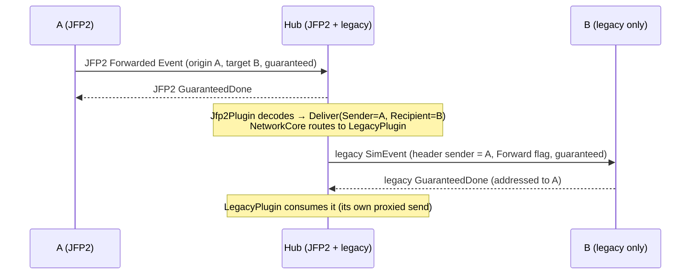

# JoinFS application architecture

**Reference document.** How JoinFS is structured: its subsystems and threads, and in depth, the
network stack in which wire protocols are plugins. It describes the code as it is
(`JoinFS/`, 2026-09). For the reasoning behind the network design and how it evolved, see
`docs/network-plugin-architecture.md`. For the wire protocols themselves, see
`docs/reference/jfp2-protocol.md` (JFP2) and `docs/network-protocol.md` (legacy).

Contents:
1. [What JoinFS is, and the vocabulary](#1-what-joinfs-is-and-the-vocabulary)
2. [Process structure and threads](#2-process-structure-and-threads)
3. [Application subsystems](#3-application-subsystems)
4. [The canonical message model](#4-the-canonical-message-model)
5. [The network stack](#5-the-network-stack)
6. [Relaying and protocol translation](#6-relaying-and-protocol-translation)
7. [The session layer (`Network.cs` and `JoinFS/Session/`)](#7-the-session-layer-networkcs-and-joinfssession)
8. [End-to-end flows](#8-end-to-end-flows)
9. [Extending JoinFS](#9-extending-joinfs)
10. [Testing](#10-testing)
11. [Source map](#11-source-map)

---

## 1. What JoinFS is, and the vocabulary

JoinFS lets pilots fly together across different flight simulators (MSFS 2020/2024, FSX, Prepar3D,
X-Plane). Every running JoinFS instance reads its own simulator's aircraft and objects, sends their
state to the other instances in the same session over UDP, and injects everyone else's aircraft into
its simulator. There is no central server: instances form a peer-to-peer mesh.

| Term | Meaning |
|---|---|
| **Node** | One running JoinFS instance on the network. |
| **Session** | A group of nodes flying together. Identified by a 32-bit session id (`suid`); `1` is the special *global* session. |
| **Hub** | A node (often the headless `CONSOLE` build) that other nodes rendezvous through. It offers directory services: hub lists, user lists, and relaying for nodes that can't reach each other. |
| **`NodeId`** | A node's network identity: public IPv4 address, UDP port, and the last octet of its LAN address (7 bytes). `JoinFS/Net/Core/NodeId.cs`. |
| **uuid** | A 32-bit *user* id derived from the installation's GUID, independent of network address. Used for "join by user id" and the address book. |
| **Object** | Anything shown in a simulator: an aircraft (plane, helicopter) or another object (boat, vehicle). `Sim.Obj` and subclasses. |
| **Owner** | Who an object belongs to: *Me* (our own aircraft), *Network* (a remote node's), or *Recorder* (being played back from a `.jfs` file). |
| **Protocol plugin** | An implementation of one wire protocol: legacy or JFP2. |
| **Canonical message** | The protocol-independent, in-memory form of a message (`JoinFS/Net/Messages`). |

## 2. Process structure and threads



- **`Main`** (`Program.cs`) owns every subsystem as a public field. It runs one work loop,
  `DoWork()`, about every 5 ms, holding one lock, `Main.conch`. Each tick it runs, in order:
  1. `sim.DoWork()` — polls SimConnect, which is where simulator callbacks run;
  2. `network.DoWork()`;
  3. `recorder.DoWork()`;
  4. `euroscope.DoWork()`, `whazzup.DoWork()`, `notes.DoWork()`;
  5. in `CONSOLE` builds, the webhook and WebSocket services;
  6. queued `Main.EnqueueCommand` actions and `schedule*` flags.
- **UI code** reads application state under `conch` from WinForms timers. Other threads ask for work
  by setting a `volatile schedule*` flag or calling `EnqueueCommand`.
- **The network stack runs on its own thread** inside `NetworkService` (`JoinFS/Net/Service`):
  - It owns the socket, the protocol plugins, the peer table and the mesh.
  - Nothing inside it takes a lock, because only that thread touches it.
  - A separate receive thread blocks on the UDP socket and puts each datagram into the network
    thread's mailbox, so a datagram is handled as soon as it arrives rather than on the next
    5 ms tick.
- **The app and the network thread meet at exactly three places:**
  1. **The mailbox** (app → network). The session layer (§7) calls `service.Post/Send/Broadcast`. Messages
     travel in pooled work items, so the steady state doesn't allocate per message.
  2. **The inbound queue** (network → app). Canonical messages and session events, in arrival order.
     `Network.DoWork` drains it at the start of its tick, under `conch`.
  3. **The snapshot** (network → anyone). An immutable `NetworkSnapshot` republished every 100 ms by
     swapping one volatile reference. The UI, `Sim` (per-peer RTT) and the CONSOLE services read it
     without locking.

**Rule:** never touch `NetworkCore`, `MeshManager`, `PeerDirectory` or a plugin from outside the
network thread. Use the mailbox to change things and the snapshot to read them.

## 3. Application subsystems

| Subsystem | File(s) | Role |
|---|---|---|
| `Main` | `Program.cs` | Composition root, work loop, settings, command-line options, shutdown. |
| `Sim` | `Sim.cs` | Simulator abstraction: SimConnect lifecycle, the object list, and per-frame reconciliation that moves each remote or recorded object toward its latest known position (`UpdateSimObjectVelocity`, see `docs/positioning-improvements.md`). Decides *which peers* get *which updates* and how often (per-peer rate masks), then hands one canonical message per tick to `Network`. |
| `VariableMgr` | `Variables.cs`, `VariableMgr.*.cs` | Declares every simulator variable JoinFS syncs, each identified on the network by a 32-bit `vuid` hash of its name. |
| `Substitution` | `Substitution.cs` | Matches remote aircraft types to locally installed models. |
| `Recorder` | `Recorder.cs` | Records to and plays back `.jfs` files. Played-back objects feed the same `Sim.Obj` path as network ones (owner *Recorder*). File version `Recorder.FileVersion`, independent of any wire version. |
| **`Network`** + session parts | `Network.cs`, `Session/*` | **The network session** (§7): hubs, users, address book, per-peer info. Turns sim state into canonical messages and incoming messages into sim, recorder and notes updates. Contains no wire-protocol code. |
| **Network stack** | `Net/**` | Transport, protocol plugins, mesh, routing, translation (§5). |
| `Notes` | `Notes.cs` | Text comms (channels, history). |
| `Log` | `Log.cs` | Per-node user choices: ignore, share cockpit, allow multiple objects. |
| `Whazzup`, `Euroscope` | `Whazzup.cs`, `Euroscope.cs` | Export traffic and ATC to third-party tools. |
| `WebSocketServer`, `WebhookService` | same names | `CONSOLE` only: live data for external tools. |
| `XPlane`, `XPlaneLink` | `XPlane.cs`, `XPlaneLink.cs` | Bridge to the native X-Plane plugin (`JoinFS-XP`) over a local UDP link that uses the legacy header format. Runs on the app thread; not part of the network stack. |
| Forms | `Forms/*` | WinForms UI, compiled out of `CONSOLE`. |

Simulator variants are separate build configurations (`FS2024`, `FS2020`, `FSX`, `P3D`, `XPLANE`,
`CONSOLE`) with preprocessor symbols. Nothing in the network stack depends on them: every variant
speaks exactly the same protocols.

## 4. The canonical message model

Everything the network carries has one in-memory, protocol-independent form: a `struct` in
`JoinFS/Net/Messages` (namespace `JoinFS.Net`). Plugins convert between these structs and their own
wire formats. The session layer, the mesh and the router only ever see canonical messages.

**Kinds** (`MessageKind`, `Message.cs`):

| Group | Kinds (struct) |
|---|---|
| Objects | `Position` (`PositionUpdate`, aircraft motion), `ObjectPosition` (`ObjectPositionUpdate`), `Identity` (`IdentityUpdate`), `VariableSync` (`VariableSyncUpdate`), `Event` (`EventUpdate`), `RemoveObject`, `FlightPlan` (`FlightPlanUpdate`), `ShowOnRadar` |
| Peers / session | `PeerInfo` (what a node tells each peer about itself, incl. cockpit sharing), `StatusRequest`, `Status`, `WeatherRequest`, `WeatherReply`, `WeatherUpdate` |
| Hub directory | `HubList`, `UserListRequest`, `HubUser` (`HubUserUpdate`), `UserPositionsRequest`, `UserPositions`, `Online` (`OnlineAnnouncement`), `UserNuidRequest`, `UserNuid` (`UserNuidReply`) |
| Comms | `CommsRequest`, `Notes` (`NotesBundle`) |
| Mesh (consumed by the core, never by the app) | `Join`, `JoinReply`, `JoinFail`, `Login`, `LoginFail`, `AddNode`, `Leave`, `Pulse`, `PulseResponse`, `Pathfinder`, `PathfinderResponse` |

**`MessageMeta`** travels with every message:
- **`Sender`**: the node the message is *from*. For a relayed or translated message, this is the
  original author, never the relay.
- **`Recipient`**: the node it is for. Invalid means "not addressed to a particular node".
- **`EndPoint`**: inbound, where it is treated as coming from; outbound, an explicit destination for
  a node not yet in the mesh (a hub or a joiner).
- **`Guaranteed`**, **`Forwarded`**, and **`DataVersion`** (a legacy diagnostic).

**Identity is separate from position.** Position carries only what changes every tick: motion,
controls, and the flags on-ground, user-controlled and paused. Model, livery, callsign, registration
and so on are an `IdentityUpdate`. Each protocol decides how to carry identity:
- **Legacy** inlines it into every position datagram.
- **JFP2** sends it on change, plus a 4-second heartbeat.

That is why the core keeps an identity cache (§5.6).

**Double dispatch.** Every message struct implements
`IMessage.Dispatch(IMessageHandler, in MessageMeta)`, which calls the handler overload for its own
type. `IMessageHandler` has one `Handle(in meta, in T)` overload per message type, and each overload
does nothing by default. This one mechanism is used in several places:
- the session layer implements it to receive messages;
- `MeshManager` implements it for mesh kinds;
- each plugin's encoder implements it to write messages.

The result is statically typed handling with no casts, boxing or `switch` on kind.

**The canonical model is not a wire format.** It is compiled into the same binary as every plugin, so
it can change freely between releases. Wire compatibility is each plugin's job. The model is the
*superset* of what the app understands: a new field is added as optional, the legacy codec ignores
it, and newer codecs carry it (`docs/network-plugin-architecture.md` §2.8).

## 5. The network stack



### 5.1 `NetworkService` — the thread

`JoinFS/Net/Service/NetworkService.cs`:

- **Thread loop.** Take work from the mailbox, waiting at most until the next tick. Execute
  everything that is ready. Call `NetworkCore.Tick()` every 5 ms. Rebuild the snapshot every 100 ms.
- **App → network API:**
  - `Post(Action<NetworkCore>)` for commands such as join, leave, create, or ban an IP;
  - `Send`, `SendTo`, `SendToEndPoint`, `Broadcast` for canonical messages;
  - `SendObjectState` for an object's identity and position, applied in that order;
  - `Open(port)`, which runs on the network thread, leaves any current session first when the port
    changes, and returns once the socket is open.
- **Network → app:** `Drain(IMessageHandler, INetworkEventHandler)` hands queued items to the app's
  handlers in order. The events are `SessionJoined`, `PeerJoined`, `PeerEstablished`, `PeerLeft` and
  `Log`.
- **`Snapshot`** (`NetworkSnapshot`):
  - session state, session id, global/creator/login flags, and the last join and login results;
  - local id, addresses and port;
  - per peer (`PeerSnapshot`): endpoint, route, direct, established both ways, low-bandwidth, RTT,
    the protocol that currently carries its positions, and a link-state description;
  - relay and guaranteed-delivery counters.
- **`Stop()`** runs any work still queued (such as a final Leave) before closing the socket.

### 5.2 `NetworkCore` — demux, delivery, sending

`JoinFS/Net/Core/NetworkCore.cs` is single-threaded and has no locks. Tests drive it directly.

**Incoming datagrams** (`OnDatagram`):
1. Drop the datagram if its source IP is banned.
2. Hand it to the first plugin whose `Accepts(datagram)` matches its magic byte.

**Decoded messages** (`Deliver<T>`, called by plugins):
1. **Mesh kinds** go to `MeshManager` and stop there.
2. **Identity** updates the identity cache; **RemoveObject** evicts from it.
3. A message addressed to *another* node is **translated**: re-sent through whichever plugin reaches
   that node (§6).
4. Object and session kinds are dropped if this node is not in a session (`RequiresSession`), as the
   legacy receiver always did.
5. Everything else goes to the app's inbound queue.

**Outgoing messages** (`Send`, `SendTo`, `SendToEndPoint`, `Broadcast`):
- Resolve each recipient's plugin with the router (§5.3).
- Group recipients by plugin, keeping their order, and call each plugin's
  `Send<T>(meta, message, recipients)` once. One encoding serves every recipient of that plugin.
- A message to a raw endpoint uses the plugin of the known peer at that endpoint, or the baseline
  plugin (legacy) if the endpoint isn't a known peer.

### 5.3 Routing — which protocol talks to which peer

For each (peer, message kind), the router picks the plugin with the highest `Preference` whose
`CanCarry(peer, kind)` is true.

- **Preferences:** JFP2 is 10, legacy is 0.
- **Legacy carries everything, to anyone**, including unknown endpoints. The only exception is
  Identity, which it carries inline in positions.
- **JFP2 carries a kind only** when the handshake with that peer completed, the agreed schema version
  for that class is above 0, and the peer is *directly* reachable (its route is its own endpoint).

The choice is cached per peer in a small array (`Peer.Routes[kind]`). It is invalidated when a
plugin reports a link change (handshake completed, peer assumed legacy) or when the mesh changes a
peer's route (pathfinder, a relay disappearing). On the hot path, routing is one array read.

### 5.4 `MeshManager` — sessions, membership, liveness, relaying

`JoinFS/Net/Core/MeshManager.cs` is a protocol-neutral port of the legacy mesh rules. It sends and
receives canonical mesh messages through the router; today only the legacy plugin carries them.

**Session lifecycle:**
- **Create:** get a session id; optionally set a password; for login-required sessions, create a
  `CredentialStore` backed by `password.txt`.
- **Join/Login:** send a guaranteed `Join` or `Login` to an endpoint. The reply is `JoinReply`, with
  the session id and every node the responder has heard from, or `JoinFail`/`LoginFail`.
- **Leave:** broadcast `Leave`, reset every plugin's session state, and forget all peers and caches.

**Membership:**
- Each node listed in a `JoinReply` or announced by `AddNode` is registered in the `PeerDirectory`.
- The first time a node is heard from, the app gets a `PeerJoined` event and every peer gets an
  `AddNode` about it.
- A node allows at most 32 instances from the same device.

**Liveness** (every 1 s):
- Broadcast `Pulse`; peers answer with `PulseResponse`.
- The first response makes the peer *established* (app event `PeerEstablished`) and yields its RTT.
- A peer silent for 30 s is removed. Its objects disappear (`PeerLeft`), and anyone routed through
  it has to find a new route.

**Relaying:**
- **Pathfinder** (every 5 s): ask directly established peers which of our not-yet-established peers
  they can reach directly. A positive answer sets that peer's route to go via the responder.
- **Relay budget:** a relaying node relays for at most 10 distinct senders at a time, shared by all
  plugins (`TryAcquireRelay`).

### 5.5 Peers and local identity

- **`PeerDirectory`** (`Net/Core/PeerDirectory.cs`) is the single peer table. It is keyed by
  `NodeId` in insertion order, which the legacy broadcast byte order depends on. Each `Peer` holds:
  - `EndPoint` (where it is) and `RouteEndPoint` (where we send);
  - `Direct` (same address; the legacy notion) and `RouteIsOwnEndPoint` (same address and port; what
    JFP2 requires);
  - receive/send established, low-bandwidth, RTT, expiry time, and the route cache.
- **`LocalIdentity`** holds our LAN address, public address (from a my-IP lookup) and port, which
  make up our `NodeId`. `MakeEndPoint` reaches a peer that shares our public IP (same NAT) on its
  LAN address instead.

### 5.6 `ObjectStateCache` — identity for translation

The latest `IdentityUpdate` of every object, keyed by (owner, object id):
- **Local objects:** filled every tick, because the app sends identity together with each position.
- **Remote objects:** filled from received identity.
- **Evicted:** with the object (`RemoveObject`), with its owner (peer left), or on leaving the session.

It is what lets the legacy plugin inline identity into a position, and the JFP2 plugin decide when
to resend identity to a peer.

### 5.7 Protocol plugins

**The contract** (`Net/Core/IProtocolPlugin.cs`):

```csharp
public interface IProtocolPlugin
{
    string Name { get; }
    int Preference { get; }
    void Attach(IProtocolHost host);
    bool Accepts(ReadOnlySpan<byte> datagram);                 // magic byte
    void OnDatagram(IPEndPoint from, ReadOnlySpan<byte> datagram);
    void Tick();                                               // retries, handshakes, expiry
    bool CanCarry(NodeId peer, MessageKind kind);
    void Send<T>(in MessageMeta meta, in T message, ReadOnlySpan<NodeId> recipients) where T : struct, IMessage;
    void OnPeerRemoved(Peer peer);
    void OnSessionReset();
}
```

- **What a plugin gets from the core** (`IProtocolHost`): the transport, clock, local identity,
  peer directory, identity cache, relay budget, `Deliver`, `LinkChanged` and `Log`.
- **What a plugin never sees:** `Main`, `Sim`, settings or forms.
- **Optional** `IDescribesLinks`: gives the UI a per-peer link-state string.

**`LegacyPlugin`** (`Net/Protocols/Legacy/`) — the frozen protocol every released version speaks
(`docs/network-protocol.md`):
- **Framing:** a 21-byte header with sender and recipient `NodeId`. One encoding goes to many
  recipients by patching the recipient field per target.
- **Encoder:** an `IMessageHandler` with one overload per message type. **Decoder:** one method per
  legacy message id, with the legacy version-gated and trailing optional fields.
- **Positions:** a legacy `AircraftPosition` decodes to `IdentityUpdate` + `PositionUpdate`, and the
  identity is re-inlined from the cache on encode. Legacy's three variable messages map to one
  `VariableSyncUpdate`.
- **Guaranteed delivery** (`LegacyReliability`): 1000-byte segments, acknowledgement per segment,
  resend every 2 s, give up after 180 s, duplicate suppression for 240 s.
- **Relay:** a datagram addressed to another node is relayed unchanged with the Forward flag, if
  that node is a direct neighbour and the relay budget allows.
- **Messages sent on another node's behalf** (translation) carry that node as the header sender with
  the Forward flag, which is exactly what a legacy relay emits.
- **Pinned** byte-for-byte by the golden fixtures in `JoinFS.Tests/Legacy`.

**`Jfp2Plugin`** (`Net/Protocols/Jfp2/`) — the newer protocol (`docs/reference/jfp2-protocol.md`):
- **Envelope:** an 8-byte header (magic `0xFA`), optional guaranteed and relay extensions.
- **Handshake:** Hello/HelloAck with each directly reachable peer the mesh knows, agreeing a schema
  version per message class (`Negotiation.cs`). Retries every 2 s; after 5 attempts the peer is
  `AssumedLegacy`.
- **Codecs:** versioned per class (`Codecs/`), resolved through `CodecRegistry`.
- **Identity before position:** before a peer's first position of an object, and whenever its
  identity changes or 4 s have passed, it sends Identity first.
- **Guaranteed delivery:** single datagram, retry every 2 s, up to 5 attempts, 30 s duplicate window.
- **Relay:** Forwarded envelopes for a direct neighbour are forwarded byte-for-byte when that
  neighbour negotiated the class, and translated otherwise (§6).

## 6. Relaying and protocol translation

Relaying and translation are generic: there is no code specific to a pair of protocols.

1. **Every node speaks legacy.** A node that can only reach another through a hub sends to it with
   legacy, and the hub's legacy plugin relays the datagram unchanged. JFP2 is only used between
   direct neighbours.
2. **Same protocol at both ends:** relaying stays inside the plugin, byte for byte (legacy
   `FLAG_FORWARD`, JFP2 Forwarded envelopes).
3. **The target doesn't speak the incoming protocol for that kind.** This happens when a JFP2
   Forwarded envelope from an older build is meant for a legacy-only node. The plugin decodes the
   message and calls `Deliver` with `Recipient` = the target and `Sender` = the original author.
   The core then:
   - updates the identity cache (Identity itself is not forwarded; it goes out inline with the next
     position);
   - routes everything else to the target's plugin, keeping `Sender`, so it is credited to the true
     author;
   - handles guaranteed messages hop by hop: the relaying node acknowledges upstream, sends a new
     guaranteed message downstream, and consumes the downstream acknowledgement addressed to the
     original author.



## 7. The session layer (`Network.cs` and `JoinFS/Session/`)

The session layer is the application's side of the network. It runs on the app thread under `conch`
and knows nothing about wire formats. It is a small facade, `Network`, and eight parts in
`JoinFS/Session/`, each owning one job and its state:

| Part | Owns | Handles |
|---|---|---|
| `Network` (facade) | the `NetworkService`; the session commands (join, login, create, leave, join a user); which plugins this build speaks | the network events; forwards every message to its part |
| `NetBootstrap` | this node's addresses and `NodeId`; the my-IP, seed-hub and ban-list downloads; the DNS cache | — |
| `PeerTable` | what each node in the session said about itself (`Nodes`: nickname, ATC, version, simulator); who has which of our controls (`share*Controls`) | `PeerInfo`; peer joined, established, left |
| `SimSender` | nothing (it maps and sends) | — (called by `Sim`) |
| `SimIngest` | the identity cache | identity, positions, variables, events, removals, flight plans, weather |
| `HubDirectory` | the known hubs (`List`), `hubs.dat`, hubs waiting to be verified, each hub's published users | `Status`, `HubList`, `HubUser`, `UserPositions` |
| `UserDirectory` | online users by uuid; the uuid helpers | `Online`, `UserNuidRequest`/`UserNuid`; `Status` (address book) |
| `HubHost` | this hub's own user list (`LocalUsers`) | `StatusRequest`, `UserListRequest`, `UserPositionsRequest` |
| `SessionComms` | how many new peers to ask for comms history | `CommsRequest`, `Notes` |

**How the parts reach the rest of the app.** Through narrow interfaces
(`Session/SessionInterfaces.cs`), not through `Main`:
- `INetworkOutbox` sends; `NetworkService` implements it.
- `ISessionState` gives the snapshot, `LocalId`, `Ready` and `Connected`; `Network` implements it.
- `ISimSink` holds what network data does to the simulator and recorder; `ISimView` is read-only
  simulator state.
- `ILocalProfile` is who we are plus the settings the session uses. `ISessionUi` is the windows the
  session refreshes. `ISessionLog` is the monitor. `IClock` is the app clock.
- `IPeerPolicy` (ignore, share cockpit, extra objects) is implemented by `Log` itself, and
  `IAtcListener` by the adapter over `Euroscope`.
- `IEndPointResolver` is implemented by `NetBootstrap`.

`MainSessionHost` implements the app-facing ones over `Main`, the simulator, the recorder, the forms
and `Settings`. It is the only session file that knows them, and it looks up the subsystems created
after the network (recorder, euroscope, notes, address book) when they're used. When one part learns
something another acts on, it raises an event that `Network` wires up: `PeerTable.HubAnnounced`
feeds `HubDirectory.SubmitHub`, and `HubDirectory.GlobalHubFound` triggers a join.

**Sending** (called by `Sim`, `Notes` and forms):

| Method | Sends |
|---|---|
| `SimSender.SendAircraftPosition(aircraft, ref pos, netTime, recipients, sharedCockpit)` | identity + `PositionUpdate` |
| `SimSender.SendObjectPosition(obj, ref pv, recipients)` | identity + `ObjectPositionUpdate` |
| `SimSender.SendEvent` / `BroadcastEvent` | `EventUpdate` (guaranteed) |
| `SimSender.SendVariables` / `BroadcastVariables` | `VariableSyncUpdate` |
| `SimSender.SendRemoveObjectMessage` | `RemoveObject` (guaranteed, to everyone) |
| `SimSender.BroadcastFlightPlanUpdate`, `BroadcastWeather` | flight plan, weather |
| `Comms.SendCommsNoteMessage` | comms note |

`Sim` keeps the rate policy: each tick it works out which peers are due an update, from distance and
bandwidth, and passes them as the recipient list. Object id `0xFFFFFFFF` addresses the recipient's
own aircraft (shared cockpit). The conversions between `Sim` types and canonical messages are pure
functions in `SimMessageMapper`.

**Receiving:**
- **Identity** (`SimIngest`) is cached per (sender, object). When it changes for an existing object,
  the object's model data is updated, and the object is respawned if the model changed.
- **Position** (`SimIngest`) is applied with the cached identity; a position whose identity isn't
  known yet is dropped. Additional (non-user) aircraft are accepted only if allowed for that node.
  The shared-cockpit position is applied to our own aircraft only from the node holding our flight
  controls. The recorder records it if recording.
- **Variables, events, flight plans, weather and removals** (`SimIngest`) go to the simulator and
  recorder; **notes** (`SessionComms`) go to `Notes`.
- **Directory messages** keep the hub list, per-hub user lists and online users up to date
  (`HubDirectory`, `UserDirectory`). Requests are answered from application state (`HubHost`,
  `UserDirectory`, `SessionComms`): status, hub list, user list, positions, session comms, and the
  location of a user.
- **Events:** `PeerJoined` adds a `PeerTable` entry. `PeerEstablished` sends our `PeerInfo` and, if
  the comms window is open, a comms request. `PeerLeft` removes the node, its cached identities and
  its objects.

**Periodic work** (`Network.DoWork`, in this order):
1. Drain the service.
2. Once this node is ready: scheduled leave, join a user, create, join, join global, login; then a
   scheduled `PeerInfo`.
3. `NetBootstrap`: apply the downloaded my-IP and ban list; refresh the my-IP every 3 hours on a hub;
   reset the DNS cache daily. The seed hubs go to `HubDirectory.SubmitHub`.
4. `PeerTable`: `PeerInfo` to every peer every 5 s.
5. `UserDirectory`: address-book status checks while the address book is open.
6. Unless the build has no hubs:
   - `UserDirectory`: online announcements to hubs, and expiring users, every 60 s;
   - `HubDirectory`: status requests to hubs every 5 s, dropping dead hubs and saving `hubs.dat`;
   - `HubHost`: rebuilding this hub's user list every 10 s;
   - `HubDirectory`: requesting hubs' user lists every 2 s while the aircraft or ATC window or
     Whazzup needs them.

**What forms read:**
- session and transport state from `network.Snapshot`;
- per-peer application info (nickname, ATC, version, simulator) from `network.Peers` (`Nodes` and the
  `GetNode*` helpers);
- hubs from `network.Hubs.List`, this hub's users from `network.HubHost.LocalUsers`.

## 8. End-to-end flows

**Our aircraft's position going out:**
1. SimConnect delivers the user aircraft's position, polled at 20 Hz, to
   `Sim.ProcessAircraftPosition`.
2. `Sim` picks the peers due an update and calls `network.SimSender.SendAircraftPosition`.
3. That builds an `IdentityUpdate` and a `PositionUpdate` and posts one pooled `ObjectStateWork`.
4. On the network thread, the identity lands in the cache and the router splits the recipients:
   - JFP2 peers: `Jfp2Plugin` sends Identity if needed, then a 111-byte Position datagram;
   - legacy peers: `LegacyPlugin` inlines the cached identity into one `AircraftPosition` encoding
     and sends it to each of them.

**A remote position coming in:**
1. The UDP receive thread puts the datagram in the mailbox.
2. `NetworkCore.OnDatagram` → the plugin decodes it → `Deliver`, identity first, then position.
3. The core queues both for the app.
4. On the next app tick, `Network.DoWork` drains them and forwards both to `SimIngest`: the identity
   is cached, and the position is applied through `ISimSink.UpdateAircraft`, which calls
   `Sim.UpdateAircraft`.
5. `Sim.UpdateSimObjectVelocity` then moves the injected object toward that position every frame.

**Joining a session:**
1. The UI schedules a join. On the next tick, `Network` posts `core.Mesh.Join(endPoint, passwordHash)`.
2. The mesh sends a guaranteed `Join`. The answering node replies `JoinReply` with the session id and
   its known nodes, and announces us with `AddNode`.
3. Pulses establish each link; `PeerEstablished` reaches the app, and `PeerTable` sends `PeerInfo`.
4. For each direct peer, `Jfp2Plugin` runs Hello/HelloAck. Once negotiated, the router moves that
   peer's supported kinds to JFP2, and the snapshot's protocol column shows it.

## 9. Extending JoinFS

**A new wire protocol:**
1. Implement `IProtocolPlugin`: framing, handshake, reliability, codecs. Pick a unique first byte for
   `Accepts`.
2. Register it in `Network`'s constructor.
3. Return true from `CanCarry` only for the kinds and peers it actually negotiated.

The router, translation and application need no changes. Test it with `TestMesh` next to the legacy
plugin.

**A new field on an existing message** (for example on `PositionUpdate`):
1. Add it to the canonical struct as optional, with a presence bit or a sentinel.
2. Carry it in a new JFP2 schema version: add a `PositionV2Codec`, register it, and raise the
   offer's max version.
3. Leave the legacy codec alone; it ignores the field.
4. Give it a default in the session part's handler for peers that don't send it.

**A new kind of message:**
1. Add a `MessageKind` value, a canonical struct implementing `IMessage`, and an `IMessageHandler`
   overload. Handle it in the session part that owns that data, and forward it there from
   `Network`.
2. Carry it in JFP2 with a new application class number, appended and never reused.
3. Legacy doesn't get new messages. Either the feature doesn't reach legacy peers, or it is expressed
   through an existing kind (for example, a sim value as a `VariableSync` vuid).

**Never change the legacy wire.** `LegacyPluginGoldenTests` fails if its bytes change, and released
builds depend on them.

## 10. Testing

`dotnet test JoinFS.Tests/JoinFS.Tests.csproj -c FS2024-Debug -p:Platform=x64`

| Tests | What they prove |
|---|---|
| `Legacy/LegacyPluginGoldenTests` + `Legacy/Fixtures/*.hex` | The legacy plugin emits exactly the bytes the pre-rewrite implementation emitted, for every message including mesh replies, chunking and segmentation. The fixtures are the frozen legacy specification. |
| `Net/LegacyMeshTests` | Mesh behaviour over the in-memory network: join, introductions, wrong password, relay between unreachable nodes, guaranteed delivery under loss, segmentation, leave, expiry, session gating. |
| `Net/LegacyRoundTripTests` | Every kind survives legacy encode/decode. |
| `Net/Jfp2PluginTests` | Negotiation, identity-then-position, fallback to legacy, mixed broadcast, JFP2 guaranteed delivery under loss, translation of relayed JFP2 for a legacy-only node. |
| `Net/NetworkServiceTests` | The threaded service over real loopback UDP. |
| `Jfp2/*` | Envelope, negotiation and each codec. |
| `Legacy/XPlaneLinkTests` | The X-Plane link framing matches what the native plugin expects. |
| `Session/SimIngestTests` | The identity cache, filtering, shared cockpit, variables, events, flight plans and weather; and end to end, a position crossing the in-memory mesh over legacy or JFP2 reaches the simulator with the same identity. |
| `Session/PeerTableTests` | What `PeerInfo` changes and reports (ATC, nickname, becoming a hub), what we share with whom, periodic and scheduled `PeerInfo`, name fallbacks. |
| `Session/DirectoryTests` | Hub discovery and caps per address, hub users, `hubs.dat` save/load, user lookup by uuid across hubs, online-user expiry, the address book, status replies. |

`Net/TestMesh` runs any number of `NetworkCore` nodes on an `InMemoryNetwork` with a `ManualClock`.
It is deterministic, supports loss and partition injection, and uses no sockets or threads.
`Session/SessionFakes.cs` has a fake for each session interface, and `SessionRig`, which wires the
session parts together the way `Network` does. A test can also replay what a `TestMesh` node
received into a session part through `IMessage.Dispatch`.

## 11. Source map

| Path | Contents |
|---|---|
| `JoinFS/Program.cs` | `Main`: composition, work loop, `conch` |
| `JoinFS/Network.cs` | Session facade: commands, message routing, the tick order (§7) |
| `JoinFS/Session/` | The session parts (§7), their interfaces (`SessionInterfaces.cs`), the adapter over `Main` (`MainSessionHost`), and `SimMessageMapper` |
| `JoinFS/Sim.cs` | Simulator abstraction, rate policy, sends via `network.SimSender` |
| `JoinFS/Net/Core/` | `NetworkCore`, `MeshManager`, `PeerDirectory`, `LocalIdentity`, `ObjectStateCache`, `CredentialStore`, `NodeId`, `NetHash`, `AddressCodec`, `Clock`, `IProtocolPlugin`/`IProtocolHost`, `INetworkSink` |
| `JoinFS/Net/Messages/` | Canonical messages, `MessageKind`, `MessageMeta`, `IMessageHandler` |
| `JoinFS/Net/Service/` | `NetworkService`, `INetworkOutbox`, `NetworkSnapshot`, pooled queue items |
| `JoinFS/Net/Transport/` | `IDatagramTransport`, `UdpTransport`, `InMemoryNetwork` |
| `JoinFS/Net/Protocols/Legacy/` | `LegacyWire`, `LegacyPlugin`, `LegacyReliability` |
| `JoinFS/Net/Protocols/Jfp2/` | `Jfp2Plugin`, `Envelope`, `Negotiation`, `Codecs/` |
| `JoinFS/XPlaneLink.cs`, `JoinFS/XPlane.cs` | X-Plane plugin bridge |
| `JoinFS.Tests/Legacy`, `JoinFS.Tests/Net`, `JoinFS.Tests/Jfp2`, `JoinFS.Tests/Session` | Network and session tests (§10) |
