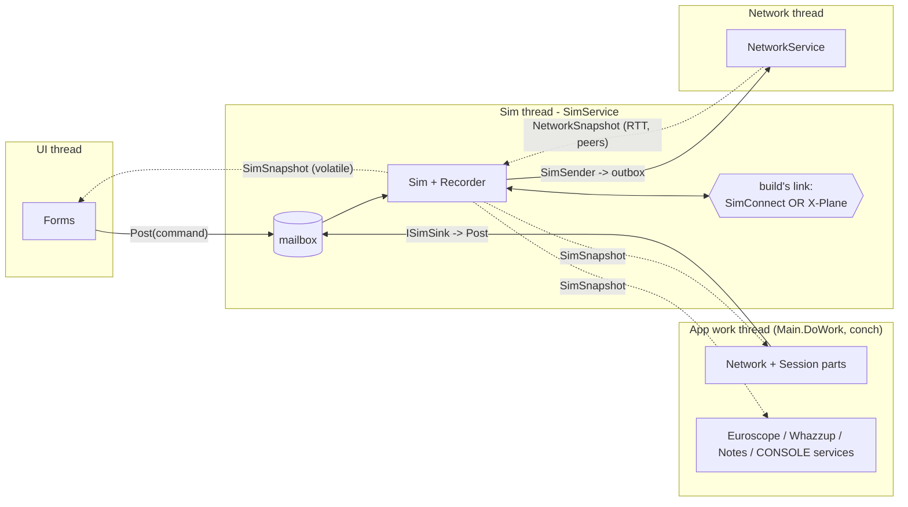

# Simulator thread: an event-driven home for `Sim`

> **What this document is:** a design proposal (status: **proposed, not implemented**, 2026-09-26).
> It covers the problem, the design chosen, the alternatives rejected, the corner cases, and a
> phased migration.
> - For how the system works today, read `docs/reference/joinfs-architecture.md`.
> - This proposal copies the threading model of the network stack (`NetworkService`, §5.1 there):
>   one owning thread, a mailbox for commands, and an immutable snapshot for reads.

## Context

**All simulator work runs in the 5 ms app loop.** `Main.DoWork()` (`Program.cs:1154`) holds
`Main.conch` and calls, in order, `sim.DoWork()`, `network.DoWork()`, `recorder.DoWork()`,
`euroscope.DoWork()`, `whazzup.DoWork()` and the queued commands. Then it sleeps whatever is left of
5 ms. SimConnect messages are pulled inside `sim.DoWork()` by one `simconnect.ReceiveMsg()` call
(`Sim.cs:5323`). That call dispatches every queued message (FRAME events, data replies, assigned
ids, exceptions) into `Sim`'s callbacks on the app thread.

This has three consequences:

- **Latency and jitter on the hot path.** `UpdateSimObjectVelocity` (the per-frame steering of every
  remote or recorded object, see `docs/positioning-improvements.md`) runs from the FRAME callback
  (`Sim.cs:4262`).
  - A FRAME waits for the next tick, and also for any of the other subsystems that happen to be holding `conch`, including the UI timers.
  - At 60 fps a frame lasts 16 ms, so being up to 5 ms late (sometimes more) is a large share of it.
  - FRAMEs that pile up during a stall are dispatched back to back, and each one steers every object again.
- **SimConnect is not thread-safe, but it is called from several threads** (SIMCONNECT builds):
  - the app thread: `Sim.DoWork`, the callbacks, session ingest through `MainSessionHost`, and
    Recorder playback;
  - the UI thread, holding `conch`:
    - `SettingsForm` → `sim.RemoveInjectedObjects()` → `DoRemove` → `RemoveObjectFromSim` →
      `simconnect.RemoveObject` (`SettingsForm.cs:246, 315`);
    - `VariablesForm` → `sim.Close()` / `sim.Connect()`, which drops the SimConnect object from the UI thread (`VariablesForm.cs:414`);
  - a thread-pool thread, **without `conch`**: `Task.Run` in `Main.DoWork` → `Substitution.Load` →
    `Scan` → `ScanSimForModels` → `main.sim.RequestSimulatorModels()` (`Substitution.cs:1803, 2480`).

  Holding `conch` stops two calls from overlapping, but it does not keep SimConnect on one thread.
  The thread-pool call does neither.
- **The SimConnect object is never disposed.** `Close()` and `XPlaneConnected` just set
  `simconnect = null` (`Sim.cs:3136, 3775`).

**Goal:**
- Put the simulator subsystem on its own thread.
- Wake that thread when the simulator has something for it (SimConnect's event handle, or a datagram from the X-Plane plugin), when another thread posts work, or when a timer is due. Nothing polls every 5 ms.
- Make every SimConnect call on that one thread.

**Decisions (agreed 2026-09-26):**
- **End state: the sim thread owns `Sim`'s state.** It works as an actor, like `NetworkService`. Sharing `conch` is only a migration step.
- **The Recorder moves onto the sim thread.** It records sim data and plays back into sim objects, so it belongs with them.
- **Replacing the 50 ms ONCE-polling with SimConnect periodic subscriptions is a later, separate phase** (Phase 3).

**Decisions on the former open questions (agreed 2026-09-26; see §8):**
- `SimIngest` stays on the app thread. Inbound datagrams are timestamped when they are received,
  and that time travels with the message to `Sim` (§2.7).
- The sim mailbox is a plain FIFO with a queue-depth metric. Coalescing is built only if the metric
  shows a need.
- Substitution publishes an immutable index for readers and builds replacements outside any lock.
  It is not an actor.
- The X-Plane plugin gets no per-frame tick. The question is closed.

---

## 1. Current state in detail

### 1.1 Threads today

| Thread | Runs | Synchronisation |
|---|---|---|
| UI (WinForms; none in CONSOLE) | Forms, refresh timers | takes `conch` to read or change app state |
| App work thread | `Main.DoWork`: sim, network session, recorder, euroscope, whazzup, notes, CONSOLE services | holds `conch`; 5 ms sleep loop |
| `JoinFS-Network` + `JoinFS-UdpReceive` | `NetworkService` / `NetworkCore` | lock-free; mailbox + `NetworkSnapshot` |
| Thread pool | `Substitution.Load`/`Scan` | none (see above) |

### 1.2 One simulator link per build

A build talks to exactly one kind of simulator, chosen at compile time (`JoinFS.csproj`):

| Configurations | Symbols | Simulator link |
|---|---|---|
| `FS2020`, `FS2024`, `FSX`, `P3D` | `SIMCONNECT` (+ sim symbol) | SimConnect library: `SimConnectInterface.cs` |
| `XPLANE`, `CONSOLE` | no `SIMCONNECT` | UDP to the native `JoinFS-XP` plugin: `XPlane.cs`, `XPlaneLink.cs` |

The X-Plane builds neither reference nor ship the SimConnect library. `Sim.cs` switches between the
two links with `#if XPLANE || CONSOLE ... #elif SIMCONNECT`. The SimConnect threading rule therefore
applies only to the SimConnect builds. The X-Plane link has its own, weaker reason to stay on one
thread (§3).

### 1.3 What `Sim` touches, and who touches `Sim`

**Inbound (other code → `Sim`).** Counted references to `main.sim` / `sim.`:

| Caller | Refs |
|---|---|
| Substitution | 51 |
| AircraftForm | 40 |
| MainSessionHost (`ISimSink`, `ISimView`) | 32 |
| Recorder | 25 |
| VariableMgr.Set | 24 |
| MainForm | 22 |
| VariablesForm | 16 |
| Others (ObjectsForm, SessionForm, HeightForm, FlightPlanForm, Whazzup, Euroscope, WebSocketServer, WebhookService, Log, Notes) | fewer each |

Most callers **read** `objectList`, `userAircraft` or `Connected`, or hold on to a live `Sim.Obj`
reference.

**Outbound (`Sim` → other code), often from inside a SimConnect callback:**
- `main.network.SimSender.*` (16 sites), which ends in the network mailbox (`INetworkOutbox`);
- `main.recorder.Record(...)`;
- `main.substitution.Masquerade / GetTypeRole / LearnIcaoFromLiveObject / SubmitModel / Match`;
- `main.MonitorEvent`, which takes `conch` internally (`Program.cs:1288`);
- `main.network.GetNodeRTT`, `main.network.Peers.*`, `main.log.Ignore*`, `main.variableMgr`,
  `Settings.Default`, `main.settings*`;
- `main.schedule*` flags and `main.EnqueueCommand(...)`.

### 1.4 Timers in `Sim.DoWork`

Each timer is polled once per 5 ms tick (`Sim.cs:2930`, `5231`):

| Work | Interval | Link |
|---|---|---|
| position requests (`RequestPosition`) | 0.05 s | SimConnect |
| object process (expiry, activity circle, take control) | 0.1 s | both |
| variables broadcast / record | 0.2 s | both |
| tracking | 1 s | both |
| info requests (`RequestInfo`) | 2 s | SimConnect |
| flight plan broadcast | 5 s | both |
| send-interval masks | 5 s | both |
| connection check | 20 s | both |
| weather request | 60 s | SimConnect |
| X-Plane heartbeat / user-position resend | 2 s / 1 s | X-Plane (`XPlane.DoWork`) |

---

## 2. Target architecture



### 2.1 `SimService`: thread, mailbox, scheduler, snapshot

A new `SimService` hosts a thread named `JoinFS-Sim`. It mirrors `NetworkService` and is the same
in every build:

- **Mailbox.** `Post(Action<Sim> command)`, backed by a `ConcurrentQueue` plus a wake event. This is
  the only way another thread changes `Sim` or `Recorder` state.
- **Scheduler.** It replaces the `Timer.Elapsed` checks: each job has a due time, and
  `NextDue()` tells the loop how long it may sleep. All the periodic work in §1.4 becomes jobs.
- **Snapshot.** A `volatile SimSnapshot`, immutable, published by swapping one reference. It is
  rebuilt at most every 100 ms, and at once after a structural change (object added or removed,
  connect or disconnect, user aircraft changed, recorder state changed). It holds:
  - connection state, simulator name and version;
  - one view record per object: owner, `netId`, kind, model or substitute, callsign, flight plan
    summary, positions, distance, flags such as injected, broadcast or recording;
  - the user aircraft's key;
  - recorder status.

  The UI, the session parts (`ISimView`), Whazzup, Euroscope, the CONSOLE services and Substitution
  read it without locks.

The loop (the marked lines differ per build):

```
while running:
  deadline = scheduler.NextDue()
  wait until deadline for:
      mailbox.Wake                               // all builds
      simConnectEvent                            // SIMCONNECT builds only
  drain mailbox, each item in try/catch          // commands, session ingest, recorder commands,
                                                 // X-Plane datagrams (X-Plane builds)
  SIMCONNECT: ReceiveMessage()                   // dispatches every queued message
  SIMCONNECT: if frameDue: per-frame steering once
  run due scheduler jobs
  if pendingClose: close the link                // never from inside a dispatch
  if dirty or 100 ms elapsed: publish snapshot
```

`timeBeginPeriod(1)`, which `Sim` already sets in non-CONSOLE builds, keeps the wait timeouts
accurate to about 1 ms.

### 2.2 SimConnect builds (FS2020, FS2024, FSX, P3D)

- **Waking on SimConnect's event handle.**
  - Today the managed constructor is called as `new SimConnect(name, IntPtr.Zero, 0x0402, null, 0)` (`SimConnectInterface.cs:76`). No window is passed, so the `0x0402` user message is dead.
  - Pass an `EventWaitHandle` as `hEventHandle` instead. SimConnect signals it whenever messages are waiting. The FSX, P3D and MSFS managed APIs all have this parameter.
  - The loop waits on it together with the mailbox wake event: `WaitHandle.WaitAny`.
- **One thread, from creation to disposal.** The `SimConnect` object is constructed in
  `CheckConnection` on the sim thread, used only there, and `Dispose`d there. `SimConnectInterface`
  records its owner thread and asserts `Thread.CurrentThread == owner` on every call (a debug
  assertion; logged once in release builds).
- **FRAME coalescing.** `ProcessEventFrame` only sets `frameDue` (and counts frames). After
  `ReceiveMessage()` returns, the loop runs `UpdateSimObjectVelocity` once per object.
  - This uses the freshest `simPosition` from the same dispatch.
  - Several FRAMEs that queued up during a stall produce one steering pass, not several.
- **Deferred close.** Losing the connection (COM `0xC00000B0` in `HandleException`, `OnRecvQuit`)
  sets `pendingClose` instead of closing inside the dispatch. This removes today's
  `lock (main.conch) { main.sim?.Close(); }` from `SimConnectInterface.HandleException`.
- **Draining.** `ReceiveMessage()` is already used today as "dispatch everything waiting": it is
  called once per 5 ms while positions are requested at 20 Hz per object, and no backlog builds up.
  - Implementation check: confirm that one call empties the queue with the event handle in use.
  - If it does not, call it until the handle is no longer signalled.

### 2.3 X-Plane builds (XPLANE, CONSOLE)

See §3.

### 2.4 `Sim` → the rest of the app (calls made on the sim thread)

- **Network.** `SimSender` writes to `INetworkOutbox`, which is already the network thread's
  thread-safe mailbox. `SimSender` also reads `ISessionState`:
  - `Snapshot` is a volatile, immutable reference, and is safe to read.
  - `LocalId` and `Connected` are plain fields written by the app thread. Make them volatile, or
    serve them from a session snapshot.
- **Peer data.** RTT, peer ids, whether a peer's simulator is connected, low-bandwidth flags and
  shared-flight-controls are read from `NetworkService.Snapshot`, not from `main.network.*`.
  `UpdateSimObjectVelocity` is the hot reader (`GetNodeRTT`).
- **Logging.** `Main.MonitorEvent/MonitorNetwork/MonitorVariables` stop taking `conch`. `Monitor`
  gets its own small lock, or a concurrent queue that the UI drains. Without this, every log line
  from the sim thread would wait on the app loop.
- **Substitution.** `Masquerade`, `GetTypeRole`, `LearnIcaoFromLiveObject`, `SubmitModel` and
  `MakeIcaoIndex` are called from sim callbacks. Meanwhile `Load`/`Scan` run on the thread pool and
  take seconds, `Match` runs on the app thread, and the matching and scan forms run on the UI
  thread. Decided design (copy-on-write, §8.3):
  - **Reads** (`Masquerade`, `GetTypeRole`, lookups) go against an immutable `SubstitutionIndex`
    published through one volatile reference. They never block.
  - **Rebuilds** (`Load`, `Scan`, `Match`, the FS2024 enumeration end in `ProcessModelList`) build
    a *new* index off to the side and publish it with one reference swap. No lock is held while the
    index is built.
  - **Small live writes** (`LearnIcaoFromLiveObject`, `SubmitModel`) go into a small overlay
    guarded by a short lock. Reads check the overlay after the index, and the next rebuild merges
    it in.
  - **Rule:** no Substitution lock is ever held across file I/O, a folder scan, or a network
    fetch, so the sim thread can never wait behind them.
- **UI prompts.** Unchanged: `main.schedule*` volatile flags and `main.EnqueueCommand`.

### 2.5 The rest of the app → `Sim`

- **Session ingest.** `SimIngest` stays on the app thread (§8.1). `MainSessionHost` implements
  `ISimSink`. Its mutating methods already return `void`, so each becomes a `Post` whose closure
  holds today's body, including the `recorder.Record` calls (`MainSessionHost.cs:128-168`).
  - Position posts carry the datagram's receive timestamp (§2.7), so the hop to the sim thread
    adds no error.
  - The queries `Available`, `TryGetOwnAircraft` and `CurrentMetar` read the snapshot.
- **`ISimView`.** `UserAircraft` and `FindUserAircraft` return snapshot view records, not live
  `Sim.Aircraft`. `CountObjects` counts from the snapshot.
- **UI commands post, keyed by `(ownerNuid, netId)`.** This applies to follow, enter/leave aircraft,
  remove, weather aircraft, tracking, variable edits, height adjustment, connect/close, and
  re-inject after settings changes. Never key a command by an `Obj` reference (it may already be
  removed) or by `simId` (the simulator reuses ids).
- **UI actions that need a result** post a command with a callback. The callback returns to the UI
  through `BeginInvoke`. The UI never blocks waiting for the sim thread.

### 2.6 The Recorder on the sim thread

- **Recording** is fed directly by the SimConnect/X-Plane callbacks and by ingest closures. There
  is no cross-thread hop per sample.
- **Playback** is a scheduler job whose next due time is the next frame's timestamp. It drives the
  same `Sim.UpdateAircraft/UpdateObject` path as today (`Obj.Owner.Recorder`).
- **The Recorder UI** posts commands (record, play, pause, overdub, seek, edit) and reads
  `SimSnapshot.Recorder`.
- **File I/O** (`Read`, `Write`) runs on a worker. The parsed recording is posted back, and a
  snapshot of the recording to save is handed out. The sim thread never waits on the disk.

### 2.7 Receive timestamps for network positions

**The problem (it exists today too).** When a network position is applied,
`Sim.UpdateObject(obj, netTime)` stamps `obj.netSimTime = main.ElapsedTime` (`Sim.cs:1395`). That
is the time the update is *processed*, not the time the datagram *arrived*. The steering then
extrapolates from that stamp (`UpdateSimObjectVelocity`: `... + main.ElapsedTime - obj.netSimTime`).
Any delay between arrival and processing therefore becomes extrapolation error:
- today, up to about 5 ms: the network thread's inbound queue waits for the app loop's next `Network.DoWork`;
- in the new design, up to about 5 ms plus the hop to the sim thread.

At 250 m/s, 5 ms is 1.25 m. Because the delay varies from update to update, the error shows up as
jitter rather than a constant offset.

**Decision.** Stamp each datagram when it is received, and carry that time all the way to `Sim`:

1. **Stamp.** `UdpTransport`'s receive thread records `Stopwatch.GetTimestamp()` right after
   `ReceiveFrom` returns, and passes it with the datagram (`DatagramWork`).
   - `InMemoryNetwork` stamps with the test clock.
   - A relayed or translated message carries the time it arrived *here*. That is the right time for
     local extrapolation.
2. **Carry.** `NetworkCore` copies the stamp into `MessageMeta` as a new in-process field,
   `ReceivedAt`.
   - Canonical messages never go on the wire, so the legacy and JFP2 formats and their golden
     fixtures are untouched.
   - Messages we build locally have no receive time, so they leave the field at 0.
3. **Deliver.** `SimIngest` passes `meta.ReceivedAt` into the `ISimSink` position methods, and the
   posting adapter puts it in the sim-thread command.
4. **Use.** `Sim.UpdateObject(obj, netTime, receivedAt)` uses `receivedAt` wherever it uses "now"
   today: for `netSimTime`, and when advancing the `netRealTime` estimate. When `receivedAt` is 0
   (recorder playback, local updates), it falls back to "now".
5. **One time base.** `SystemClock.Instance` (network) and `Main.stopwatch` (`Main.ElapsedTime`)
   are separate stopwatches with different start times, so their values can't be compared. Make
   `Main.ElapsedTime` delegate to `SystemClock.Instance.Now`. Every thread then shares one
   epoch, and a raw `Stopwatch` timestamp converts with one subtraction and division.
   - Almost every use of `ElapsedTime` is a difference, so moving its start point is harmless.
   - One use is absolute: `MainForm.cs:526` checks `main.ElapsedTime < 6.0` ("shortly after
     startup"). Touch `SystemClock.Instance` in `Main`'s constructor, where `stopwatch` starts today,
     so the start point stays the same.

This change doesn't depend on the sim thread. It can ship right after Phase 0 and already removes
today's error.

### 2.8 Mailbox load: FIFO plus a metric

The sim mailbox is a plain FIFO (§8.2).
- `SimService` tracks the current queue depth, the peak since the last snapshot, and the oldest
  item's age when it is dequeued.
- It publishes them in `SimSnapshot` and shows them in the Monitor.
- It logs a rate-limited warning when the age exceeds a threshold (a starting value of 20 ms, to be
  tuned).

Per-object latest-wins coalescing (§8.2 option B) is built only if field data shows this threshold
being crossed in practice.

---

## 3. The X-Plane variant (XPLANE and CONSOLE builds)

The X-Plane builds have **no SimConnect**: no SimConnect event handle, no FRAME event, and no
SimConnect threading rule. They still fit the same `SimService`, driven differently.

**The plugin already does the per-frame work.** `JoinFS-XP` injects aircraft through XPMP2 and
interpolates them every X-Plane frame (`DoFrame`, flight loop registered at -1,
`JoinFS-XP.cpp:2350`). It also sends to JoinFS:

| Message | Interval |
|---|---|
| user aircraft position (`DoAircraftPosition`) | 0.1 s (10 Hz) |
| model info (`DoModel`) | 4 s |
| state (`DoState`) | 1 s |
| variables (`DoVariables`) | 1 s |
| heartbeat (`DoHeartbeat`) | 2 s |

So JoinFS has nothing to do per frame for X-Plane. It only reacts:
- a network position arrives → it is forwarded to the plugin (`XPlane.UpdateAircraft`);
- a plugin datagram arrives → it is decoded and handled.

**What wakes the thread:**
- **Plugin datagrams.** Today `XPlaneLink.DoWork` polls `client.Available` every tick
  (`XPlaneLink.cs:118`).
  - Instead, `XPlaneLink` sits on the existing `UdpTransport` (`JoinFS/Net/Transport/UdpTransport.cs`), which the network stack already uses. Its dedicated receive thread raises `Received(endpoint, buffer, length)`.
  - `XPlaneLink` copies the datagram into a sim-mailbox item, which wakes the thread.
  - Header checks, decoding (`XPlane.ReceiveMsg`) and the `Sim` callbacks it triggers all run on the sim thread: `XPlaneModelUpdate`, `ProcessAircraftPosition`, `XPlaneConnected`, `XPlaneRemove`.
  - Reusing `IDatagramTransport` also means tests can drive the link over `InMemoryNetwork`.
- **Mailbox posts:** network ingest, UI, recorder.
- **Scheduler jobs:**
  - heartbeat to the plugin (2 s);
  - user-position resend (1 s);
  - connection attempts (`xplane.Open()` from `CheckConnection`);
  - the shared jobs of §1.4 marked "both".

This is portable .NET. CONSOLE runs on Linux (the Docker hub image) with no Win32 handles, and
nothing here needs one.

**Why X-Plane work still stays on the sim thread:**
- `XPlaneLink` builds every outgoing message in one shared `sendStream`/`writer`, so it is not
  thread-safe. All sends must come from the sim thread: `UpdateAircraft`, `InjectAircraft`,
  `RemoveAircraft`, variables, events, definitions, heartbeat, CONNECT/DISCONNECT.
- `XPlane.aircraftList` (the plugin's injection slots) belongs to the same thread as `Sim`'s
  `objectList`, which it mirrors.
- Today one such send already comes from the UI thread: `XPlane.InstallPluginUI` → `sim.Close()` →
  `xplane.Close()`, which sends DISCONNECT. It becomes a posted command.

**CONSOLE with X-Plane disabled** (`settingsXplane` false, the usual hub): the thread sleeps on the
mailbox and scheduler only. Recorder playback and network ingest still pass through it. The cost is
one mostly idle thread.

**No change to the X-Plane wire or the plugin.** `DATA_VERSION`, `LegacyWire.Version` /
`Link::NODE_VERSION` and the native code are untouched, and nothing needs rebuilding on the
X-Plane side.

**Cleanup found along the way.** `XPlaneConnected` contains `#if SIMCONNECT simconnect = null; #endif`
(`Sim.cs:3773`). The X-Plane builds never define `SIMCONNECT`, so this is dead code and should be
removed.

**No per-frame tick from the plugin (decided, §8.4).** XPMP2 already does the per-frame work on the
X-Plane side, so a tick would add loopback traffic and a plugin release for no benefit.

---

## 4. Alternatives considered

| # | Idea | Verdict |
|---|---|---|
| A | **SimConnect-only I/O thread with a command queue; `Sim` state stays under `conch`.** | Kept only as migration Phase 1. As an end state, frame steering still contends with every `conch` holder (app loop, UI timers). |
| B | **Win32 message pump (`WM_USER_SIMCONNECT` to a window), SimConnect builds.** | Rejected. It ties the SimConnect link to a message-loop thread and needs a window; the event handle needs neither. |
| C | **`Socket.ReceiveAsync` loop for the X-Plane link.** | Workable, but `UdpTransport` already exists with the same behaviour and is testable over `InMemoryNetwork` (§3). |
| D | **Run `SimIngest` on the sim thread, fed directly by the network thread.** | Rejected (§8.1). `SimIngest` depends on `PeerTable`, the ignore policy and the identity cache, all of which live on the app thread. Receive timestamps (§2.7) remove the hop's cost instead. |
| D′ | **Send only position messages from the network thread straight to the sim thread.** | Rejected (§8.1). It breaks ordering: a node's removal travels through the session on the app thread, so a position already in flight could re-create a ghost aircraft after it. |
| E | **One runtime `ISimBackend` interface over both SimConnect and X-Plane.** | Rejected. The builds are mutually exclusive, and the links behave differently (JoinFS steers every frame vs. the plugin interpolates). `Sim.cs` already selects at compile time; only the thread host is shared. |
| F | **Keep the 5 ms loop but call `ReceiveMsg` more often.** | Rejected. It spins more, fixes neither the thread-safety nor the `conch` contention, and does nothing for X-Plane. |

---

## 5. Corner cases

"SC" marks SimConnect builds only, "XP" marks X-Plane builds only, and "all" marks every build.

1. **Connecting and reconnecting (SC).**
   - The `SimConnect` object is created and disposed only on the sim thread.
   - While disconnected, the thread waits on the mailbox and scheduler; the 20 s connection check is a job.
   - `FileNotFoundException` (SimConnect not installed) still sets `scheduleAskSimConnect`.
2. **Closing during a dispatch (SC).** A lost connection or `OnRecvQuit` sets `pendingClose`. The
   link closes after `ReceiveMessage()` returns, then `Dispose` runs, which fixes the leak.
3. **FRAME storms (SC).** At 60–144 fps, FRAMEs are coalesced into one steering pass per loop
   iteration. If one iteration takes longer than a frame, a rate-limited warning is logged.
4. **FRAME stops (SC).** While paused, in menus or loading, FRAMEs may stop arriving. Expiry,
   variable sends, connection checks, recorder playback and snapshot publishing all run on
   scheduler deadlines, so they keep going.
5. **Ordering (all).** One FIFO mailbox keeps each source's posts in order: a remove posted after a
   position is applied after it. There is no ordering between different sources (UI vs. network),
   and none exists today either.
6. **Mailbox flooding (all).** Many aircraft at high send rates produce many position posts.
   - Even 50 aircraft at 20 Hz is only about 1,000 posts per second, which is light for a
     dedicated thread.
   - The mailbox stays a plain FIFO. The queue-depth and item-age metric (§2.8) shows whether this
     ever becomes a problem.
   - Per-object coalescing is built only on that evidence (§8.2). It would have to keep every
     sample for objects being recorded.
   - Because positions carry their receive time (§2.7), a short queue delays how soon a position
     is applied, but does not make it less accurate.
7. **`simId` reuse (all).** Commands address objects by `(ownerNuid, netId)`. A late SimConnect reply
   for a removed `simId` finds nothing in `objectList` and is ignored, as today.
8. **Object creation (SC).** `creatingObject`, `ProcessAssignedObjectId` and exception 22
   (injection failed) all run on one thread, so there is no cross-thread race.
9. **Deadlocks (all).**
   - Nothing holding `conch` ever waits for the sim thread.
   - From Phase 2 on, the sim thread never takes `conch`.
   - Results come back through callbacks, never through a blocking wait.
10. **Exceptions (all).**
    - Every mailbox item, callback and job runs inside try/catch, so the thread survives.
    - `AccessViolationException` from the native SimConnect DLL cannot be caught on .NET Core. This is a known limit, as today.
11. **Shutdown order (all):**
    1. stop the app loop;
    2. `SimService.Stop()` posts the close;
    3. on the sim thread, the SimConnect `Dispose` or the X-Plane DISCONNECT runs;
    4. join with a timeout;
    5. stop `NetworkService`.
12. **Model scan (SC, FS2024).** `ScanSimForModels` posts `RequestSimulatorModels` instead of
    calling it from the thread pool. `ProcessModelList` → `Substitution.SubmitModel` then goes
    through Substitution's own synchronisation (§2.4).
13. **X-Plane link states (XP).**
    - Plugin not running: CONNECT gets no reply, and the thread only wakes for scheduled
      connection attempts.
    - Plugin restarted: `XPlaneConnected` fires again on the sim thread.
    - Datagrams after close: the `UdpTransport` is closed, and items already queued are dropped
      because the link is marked closed.
    - Wrong `DATA_VERSION`: still sets `scheduleAskPlugin`.
14. **Settings changes (all).** The label flags, activity circle, ATC mode and nickname display are
    read on the sim thread. Changes that require work, such as re-injecting objects, are posted as
    commands. Plain values are read as today; tearing is harmless for single primitive fields.

---

## 6. Migration phases

Each phase ships and field-tests on its own.

### Phase 0: guards and fixes (no behaviour change)
- Add the owner-thread assertion to `SimConnectInterface`, and to `XPlaneLink` sends.
- Move the thread-pool call: route `ScanSimForModels` through `main.EnqueueCommand`.
- Dispose the SimConnect object on close.
- Make `Monitor` independent of `conch`.
- Remove the dead `#if SIMCONNECT` in `XPlaneConnected`.

### Phase 0b: receive timestamps (small behaviour change, ships independently)
- One time base: `Main.ElapsedTime` delegates to `SystemClock.Instance` (§2.7).
- `UdpTransport` and `InMemoryNetwork` stamp datagrams. `MessageMeta.ReceivedAt` carries the stamp
  through `SimIngest`/`ISimSink` to `Sim.UpdateObject`.
- This already removes today's error from the app-loop hop. Before and after measurements go with
  the formation test in §7.

### Phase 1: the thread exists, `conch` still shared
- `SimService` runs the §2.1 loop, but takes `conch` around each drain/pump/jobs block.
- Remove `sim.DoWork()` and `recorder.DoWork()` from `Main.DoWork`.
- **SC:** create SimConnect with the event handle, and add FRAME coalescing and the deferred close.
- **XP:** move `XPlaneLink` onto `UdpTransport` and feed datagrams through the mailbox.
- Calls into the link from other threads go through an outbound queue in `SimConnectInterface` /
  `XPlane`, drained at the start of each wake. State changes still happen immediately under `conch`,
  so existing readers stay correct.
- **Result:** simulator events are handled as soon as they arrive, every SimConnect call is on one
  thread, and code churn is small.

### Phase 2: the sim thread owns the state
- Introduce `SimSnapshot` and posted commands.
- Convert:
  - the forms: AircraftForm, ObjectsForm, MainForm, VariablesForm, FlightPlanForm, HeightForm,
    RecorderForm, SessionForm, SettingsForm;
  - `MainSessionHost` (`ISimSink`/`ISimView`);
  - Whazzup, Euroscope, WebSocketServer, WebhookService, Log, Notes.
- Move the Recorder fully onto the sim thread (§2.6).
- Make Substitution safe to read concurrently with the copy-on-write index and live-write overlay
  (§2.4). This can land earlier, because the thread-pool `Scan` already races today.
- Add the mailbox depth and age metric (§2.8).
- Stop the sim thread taking `conch`.

### Phase 3: subscriptions instead of polling (SC)
- Replace the 50 ms ONCE requests in `RequestPosition` with per-object `RequestDataOnSimObject` at
  `SIMCONNECT_PERIOD.SIM_FRAME` / `VISUAL_FRAME`, with an interval.
  - Subscribe when an object is listed or created, and cancel the subscription when it is removed.
  - Keep the per-object request ids (`PositionPollRequestIdBase`).
- Replace the 2 s by-type `RequestInfo` poll with `ObjectAdded`/`ObjectRemoved` (already subscribed)
  plus one info request per new object, and a slow by-type sweep as a safety net.
- Re-derive the `positionCount` / `IntervalMask` send cadence against the new data rate.
- Field-test send rates, bandwidth and smoothness against v26.5 before release.

---

## 7. Testing

- **Unit tests for `SimService`** with `ManualClock` and fakes, in the style of `SessionRig` /
  `SessionFakes.cs`:
  - mailbox ordering;
  - scheduler deadlines;
  - deferred close;
  - snapshot publication and dirty-triggered rebuilds;
  - optional coalescing.
- **SimConnect-path logic** (FRAME coalescing, the object-creation handshake) is tested with the
  SimConnect calls stubbed. The test project compiles as `FS2024-Debug`, so only SIMCONNECT code is
  visible there.
- **X-Plane path.** Feed captured plugin datagrams into `XPlaneLink` over `InMemoryNetwork`. This
  code compiles only in `XPLANE`/`CONSOLE`, so it needs a CONSOLE-configured test run (as for the
  Docker image) or manual testing.
- **Thread affinity.** The Phase 0 assertions run in every test and fail on any off-thread
  SimConnect call or `XPlaneLink` send.
- **Existing tests.** `JoinFS.Tests/Session` end-to-end runs (`TestMesh` → `SimIngest`) keep
  passing with a posting `ISimSink`.
- **Receive timestamps.** `TestMesh` with `ManualClock`: deliver a position, advance the clock
  before the app drains the queue, and assert that `netSimTime` equals the arrival time, not the
  drain time. Also check the fallback to "now" for recorder and local updates.
- **Substitution index.** A reader keeps getting consistent answers while a rebuild runs and
  publishes on another thread. Overlay writes are visible at once and survive the next rebuild.
- **Formation measurement.** In a two-instance MSFS test, fly close formation at speed and log the
  distance between each object's steered sim position and its extrapolated network position. Do
  this before Phase 0b, after it, after Phase 1 and after Phase 3.
- **Manual testing:**
  - two MSFS 2020/2024 instances (`docs/protocol-v2-manual-test-guide.md`), comparing remote-aircraft smoothness and CPU against the current build;
  - X-Plane on Windows;
  - the CONSOLE hub in Docker on Linux.

---

## 8. Decisions on the former open questions (agreed 2026-09-26)

### 8.1 Where does `SimIngest` run? → app thread, with receive timestamps

| Option | For | Against |
|---|---|---|
| **A. App thread; `ISimSink` posts to the sim thread** ✔ | Session code is unchanged. Session state stays single-threaded. One ordering path: the session decides, then Sim acts. | An extra hop of up to ~5 ms and a post per message. |
| B. All of `SimIngest` on the sim thread | No hop. | `PeerTable`, the ignore policy and the identity cache would need snapshots or locks, and the network thread would have to split its inbound queue. |
| C. Only positions go straight to the sim thread | Lowest latency where it matters. | Ordering breaks, and removed peers can come back as ghost aircraft (§4 D′). |

**Decision: A, with the datagram receive time carried to `Sim` (§2.7).** The hop's only real cost
was the extrapolation error from stamping at processing time, and the receive timestamp removes it.

### 8.2 Mailbox load → plain FIFO plus a metric

| Option | For | Against |
|---|---|---|
| **A. Plain FIFO** ✔ | Simple and exact. Recording gets every sample. | Unbounded if the sim thread stalls. |
| B. Latest-wins slot per object for positions | Memory is bounded by the object count, and the freshest data is applied. | Must respect removes and identity changes, and must keep every sample while recording. |
| C. Bounded queue that drops the oldest items | Trivial. | Can drop removes and commands. Unsafe. |

**Decision: A, with the depth and age metric (§2.8). Build B only if the metric shows a need.** The
expected load is small, and the design keeps disk and scan work off the sim thread, which were the
likely causes of stalls.

### 8.3 Substitution concurrency → copy-on-write index, not an actor

| Option | For | Against |
|---|---|---|
| A. One lock around everything | Smallest change. | `Scan` holds it for seconds, so the sim thread stalls and remote aircraft stutter. |
| **B. Immutable published index; rebuilds swap it in; live writes go to a small locked overlay** ✔ | Readers never block, and long work holds no lock. | Needs a clean split between building the index and querying it in `Substitution.cs`. Memory for two indexes during a rebuild. |
| C. Substitution as its own actor | Clean ownership. | `Masquerade` must answer when an object is created, so injection would need an async handshake. `Scan` would still need a worker. |

**Decision: B (§2.4).**

### 8.4 Per-frame tick from the X-Plane plugin → no; closed

| Option | For | Against |
|---|---|---|
| **A. No tick** ✔ | No plugin change. XPMP2 already does per-frame interpolation. | None. |
| B. Per-frame tick datagram | Would let JoinFS do per-frame work for X-Plane. | 60–144 loopback datagrams per second for no current use. A `DATA_VERSION` bump, a plugin rebuild, and testing on an under-maintained variant. |

**Decision: A. The question is closed.**
